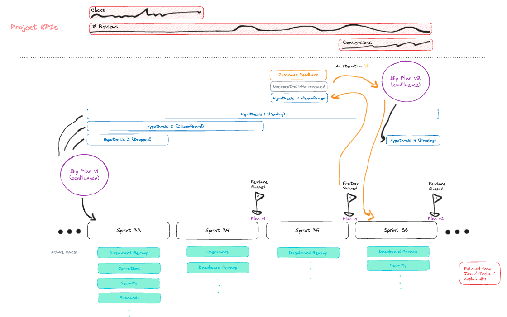

We feel that roadmapping today can be better. While over the years we as an industry have gotten
better at jira and agile, at times it seem's we've become enslaved by our tools. Particularly the
way roadmaps are created and visualized is something that seems to create tendencies that work
against the iterative approach. This post is about discussing better tools, why we need them, and
how they can look like.

## Challenges with Roadmapping Today

### The Cost of Meetings

When aligning priorities and estimating items, it is easy to get lost in this process. The cost of
these planning meetings is a blind spot for many companies. Instead of going for the quickwin and
getting insights, things tend to be planned 10x over, before the first move is made. What we need
is more `bias for action`.

### Planning Paralysis

It is hard to say when a plan is finished. For roadmaps epics are created. Individual tickets are
created and groomed. The estimated size of the Epic becomes clear and gets approved somewhere in
thea area around C-Level. To get approval for an idea, all the details need to be mapped out, and
you might find as many reasons to do a thing, as there are to not do that thing.

### Planning Software

We've come a long way in the industry. Collectively, we have learned that making a long plan for a
thing doesn't really work in software. That's why we've turned from Waterfall to Scrum or
Agile. Working in iterations, we're supposed to aim at *some* result at the end of each
sprint. From this result we can learn, reflect and adapt, in order to stay on course. Thinking up
a huge plan ahead of time and following it 1:1 does generally not work in software development.

### The Concept of Epics

Epics are one big chunk of work on the roadmap. They can represent a feature, an effort or an
initiative. They are timebound and generally have a concrete goal. Epics are generally prefilled
with all necessary tickets, and estimated before the Epic is started. This is to get the approval
for the idea given the complexity, effort, dependencies and projected result, while also fixing
the start and finish. Because Epic configurations are approved by leadership, changing the epic
after it is started is problematic, even by iterative findings that came up in the sprints. This
is how Epics tend to stand opposite to the iterative approach.

### Tool Blindness

Today, agile has spread almost into every software company. There is hardly any place that doesnt
use a tool like jira, clickUp or trello to manage their plans. While we have gotten pretty used
to a planning `status quo`, and putting things in their right places in our tool of choice, hardly
anything ever goes according to plan. We use modern tools and fill out all the colorful boxes, but
we get disappointed every time as the deadline has to be moved, as that Epic has to be extended
that little bit.

### Visual Bias

The way that roadmaps are visualized creates a certain bias for something that we know not to be
true in software: Long-term plans don't work out as expected. Yet looking at the roadmap tools, we
set start and end-dates for everything. You can have a team of product managers raging because
each of them marked an Epic as done on the roadmap, meanwhile none of them have talked to the
customer. Tools today create a bias to execute things perfectly just as planned, not to learn,
reflect and iterate.

## A new idea

One CEO we both knew always used to say:

> Verify your hypothesis as early as possible.

It seemed to be a core learning of his after many hard years in the startup world. We decided to
take this quote as the foundation to a new way of planning. What C-Level cares about at its core
is not that colorful bubbles stay exactly where they were originally created in jira. What C-Level
cares about is to validate hypotheses. To learn critical information about the customer and the
future of the business.

While it is true that probably behind every Epic are one or more core ideas, Epics itself are not
hypotheses. Epics are planned items of work on a high level, but including all individual tasks as
well, bundled up with a start and estimated end. Following a huge plan in software development is
something that historically must end in disappointment, and which lacks the iterative
components. In contrast, trying to verify a hypothesis as early as possible seems to be close to
the heart of the iterative approach.

### Hypothesis-led Roadmaps

If we can reduce roadmaps to their essence which are the hypotheses, we can start thinking of a
new way of roadmapping, and new tools.

When roadmaps were just a set huge plan for people to execute, not a lot of additional information
was needed. As hypotheses are thinner than epics, as they are more condensed, we need additional
information to help out here. This is what we need from a truly iterative roadmap:
- `Central KPIs` with their start and end date visually in the roadmap
- `Hypotheses` as the center piece
- `Big releases` featured (ideally they affect the KPIs)
- `Iterations` as visual features. Based on a release you may receive customer data or feedback and
  make a decision. This needs to be on the roadmap to create a new bias. Circles over circles
  instead long bars!
- `Sprints` near the bottom to again highlight the visual nature. A sprint is a planned iteration
  and thereby connected to the releases.

Such a roadmap is one that would be truly iterative. That's why we dub this concept as "agile
roadmaps". It is more in line with what we as engineers know to be true in software engineering,
while it also caters to the most important need of C-Level: Validating hypotheses.

At the same time it addresses all mentioned problems from earlier:
- The Cost of Meetings
  - Extensive planning and approval of long-winded plans is avoided as initiatives are condensed
    to their hypothesis. Deadlines can exist, but generally hypotheses should be confirmed as soon
    as possible. Weekly status meetings on selfmade deadlines can be skipped, and we can instead
    focus on the metrics and the next iteration.
- Planning Paralysis
  - Reducing the amount of planning that goes into approval of a hypothesis to be worked on
    reduces the amount of planning needed. The only thing that's needed is an idea for the first
    sprint, and from there we can go iteratively.
- Planning Software
  - Moving software planning closer to the iterations and learnings based on user data puts
    software development in the place where it can work. Delivering iteratively is the way to go
    in software, while trying to hit the target a bit closer every time.
- The Concept of Epics
  - Focussing on hypotheses changes roadmapping fundamentally. Instead of pre-planning everything,
    we expose the core ideas of our plans to the brain hive of the entire company. We focus closer
    on what truly matters to leadership: To confirm or to disconfirm an open hypothesis.
- Tool Blindness
  - Instead of celebrating "marking something off the list", without talking to the customer or
    looking at the KPIs is hardly possible with such a visualization. If no iteration was done or
    the KPI didn't move, the real impact of the work is clearly visible.
- Visual Bias
  - Agile roadmaps create a bias towards sprint-based releases and towards true iterations towards
    a measured goal. Todays roadmaps reward product managers for finishing an epic. Roadmaps of
    the future will reward product managers for iterating.

### The Components

- Hypotheses: Can be either open / confirmed / disconfirmed / dropped or inactive
- Iterations: While originally every sprint was supposed to be an iteration, in reality this often
  does not lign up. Iterations in agile roadmaps require three things:
  - Customer data / feedback
  - A release this feedback releates to
  - An insight, decision or learning

A real brain teaser will be the fact that we have to stop thinking exclusively in deadlines. Yes,
deadlines can and do exist, but deadlining everything that moves has honestly proven
inefficient. Putting a deadline on something that gets then moved again, again and again is not
only stressful, dull and repetitive, it also drives up the hidden cost of meetings and
frustration.

With a hypothesis-led roadmap, once a hypothesis is open, it should be confirmed as soon as
possible. Iterations will be created iteratively, as we learn more about the problem and `take
action`. Hypotheses that are open clearly have this indication that they need to be verified asap,
but they do not have a deadline on the roadmap and simply stretch to the current length of the
display. It is the job of the project manager to verify such a hypothesis with the insights that
are gained from iterations.

### More than a Sketch

We decided only having it as a sketch was not enough, and we created an initial prototype for this
idea. The plan is to at one point integrate it will all major agile planning systems. A new
visualization in our mind can make the real difference in the daily lifes of many people.

You can check out the demo here: https://flyck.gitlab.io/agile-roadmaps/

If you would like to see this prototype further build out, please let us know either by starring
the repository or by reaching out in some other way. We will base our future actions on this
project purely on the feedback we receive for this blogpost.

## FAQs

### What is the Line of Control?

Condensing the epics into their hypothesis and ligning it up next to KPIs, releases and
iterations, also gives a new finer level of delegating control. Before with Epics, everything is
one unit, from the individual tasks to timing to dependencies and scope. Epics get approved as one
packed bundle somewhere near or by C-Level.

With a hypothesis-led roadmap, leadership gets more options where they want to draw the line. Do
they want to only set the KPIs? KPIs and hypothesis? KPIs, hypothesis and sprint goals?
Kpis, hypothesis, sprint goals and iterations? The answer to this question will vary from leader
to leader. More delegation could in the end lead to more empowerement, more drive by the
employees, and more time freed up from all of that.

### Why Reinvent Roadmaps?

Isn't it the case that iterations already exists today in the form of sprints? Epics and
hypotheses are also not too far apart. Releases can be displayed on a jira roadmap, etc. All this
is true, but still we believe a new way to create roadmaps is needed.

> With the right mindset and with aligned priorities, you can work truly agile today, even in
> tools like jira.

The issue is that current roadmap tools create a certain tendency away from what we know to be
best for software engineering: The iterative approach. That's why we need a new way to look at
roadmaps and a new tooling. Whether this is our current approach or somebody creates a smart
plugin within these tools remains to be seen. But in our minds, something needs to
change. Software project planning needs to be better.

### Where do I start?

Given that a few of the ideas in this post convinced you to try and start moving closer to a
hypothesis-led agile roadmap, what could be done? These are the steps you could take if you're not
doign so already:
- Clearly write down the hypotheses behind your epics
- Talk to your users and use this feedback as input for your next sprint planning
- Make sure you have a live dashboard somewhere of your KPIs
- Avoid big bang releases at the end of epics and figure out how roll out partial solutions
  iteratively to end customers
- At the end of an epic, take the time to analyse the numbers and the real impact

## Rounding Up

We hope to have hit a nerve here with our take on better roadmaps. We truly believe in our daily
lives that roadmaps can and must be better. A dusty roadmap that was planned a long time ago in
the end can only lead to dusty meetings. Let's change this!
