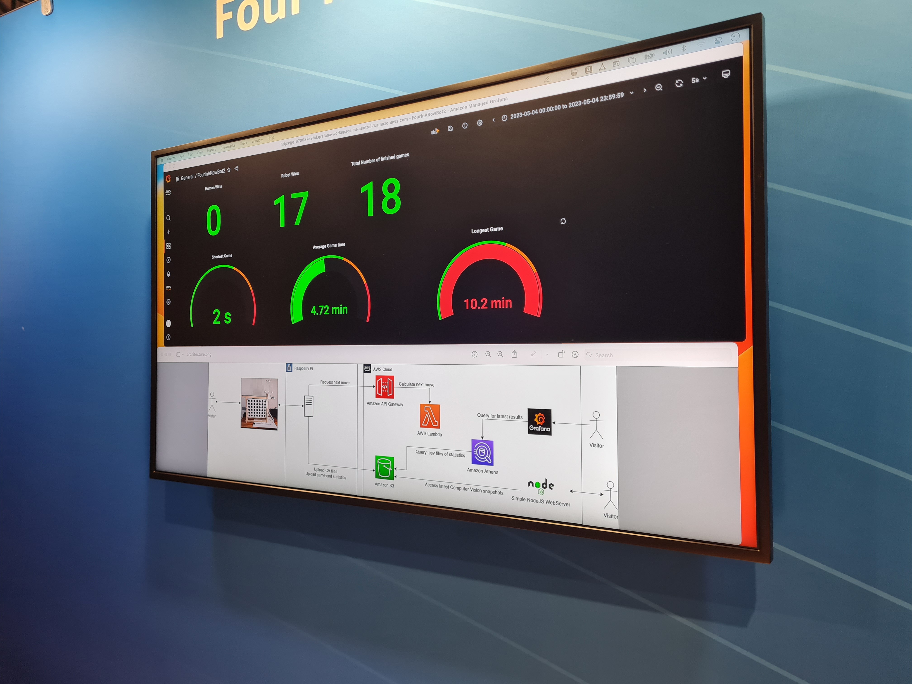
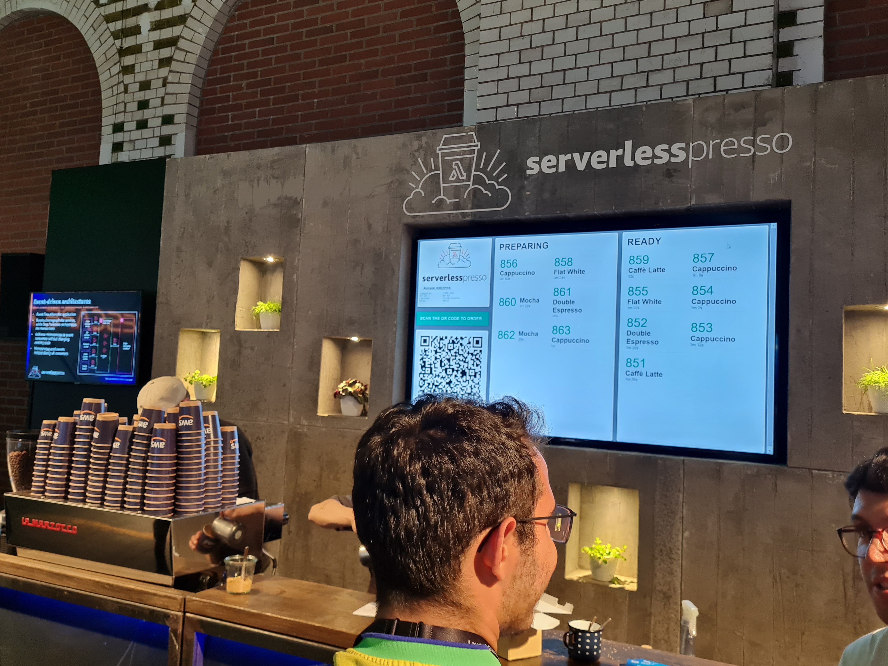

This years Berlin Summit showed why it needs to be taken seriously. The usual two day format got
compressed into one, which made it feel that much more exciting. Polished booths, a diverse crowd,
plenty of snacks, exciting challenges and good talks.

During this Summit Hendrik had stayed away, in part because of mixed reviews from
previous years, so only I went. And it was worth it!

# First Impressions

Heading straight into the "AWS World" area, waiting there was a difficult and fast-paced AWS quiz,
along with AWS socks and stickers. The quiz was exceptional, and I really wish they would bring it
out as an app for training.

A cloud style escape room, a Four In A Row (Vier gewinnt) against AI, and AWS Principal Cloud
Architects already waiting on the sidelines, made me eager to come back later and explore
more. The Four In A Row was interesting, as the metrics were published through Athena into a
Grafana dashboard. Nice to see that for small datasets and optimized queries, load times can be as
fast as 0.5 seconds.

But off to the talks! AWS divides its talks into skill levels: 200, 300 and 400. These talks are
not livestreamed, and they are not uploaded to youtube. With the occasional exception of the
keynote, you have to be there to see them.

As the Summit is traditionally not a release-fest like Reinvent, and also many of the talks are
held by aws customers, picking a talk is not as easy as searching for an AWS service. Instead of
pure technical deep dives, many of the Summit talks consist of stories. Big AWS customers like
Volkswagen, Merzendes Benz & more, share learnings from some of their biggest cloud
endeavours. While some of them keep it light, or shy away from technical details, in others a
leading engineer will bluntly tell you what worked and what didnt. Besides that, there are also
those expert talks by AWS, that focus only on a given architecture or pattern. Independent of
your skill level, this can give you a *feel* for aws - something that cannot be found in the docs,
the product video or in tutorials.

While I thought the keynote was underwhelming due to its overly heroic focus on the situation in
Ukraine, and the boring talk from Siemens, what followed was much better. After past years of swag
hunting, this year I was satisfied with the AWS socks and stickers I got early on, and got sucked
into one talk after the other.

# Ideas and Highlights

Opposite to the Nodeconf we visited last year, the Berlin Summit didn't really have a common
theme - well, except for the usage of AWS. The different stories and learnings provided by big AWS
customers, as well as from AWS themselves, still provided a constant stream of brainfood and new
ideas.

Ideas from the talks I saw:
- Data Visibility in the company is key.
- Consider the impact a customized experience could have on your customers and revenue.

Highlights and Learnings:
- The talk by XYZ on silos.
- A "Zero ETL" AWS solution is coming up later this year, using Aurora and Redshit. A solution
  that aims at simpler, on-demand data pipelines.

# Recommendations

When visiting the summit:
- Enter the AWS world area early. Here you get cool AWS swag but without the sales pitch. A good
  thing to mark off your list early in the day.
- Stay away from the booths, they are honestly not worth it. They want to book a sales demo with
  you, but you for the most part, you just want their swag. A combo that is bound to nibble on
  your precious energy on this long summit day.
- Stay away from the general coffee, and from the free sodas. One or two of those and you'll be
  fine, but one too many and you'll be off on a weird sugar-caffeine
  rollercoaster. Serverlesspresso all the way!
- Getting a cool coffee at Serverlesspresso is a must. It is the way to get to know new tech
  people in the industry, and to hear their stories. There's nothing easier than staring at a step
  function brewing your coffe, and chatting up the next one in queue, who is doing the same.
  
- To navigate around the summit, get a paper map outside of the keynote hall, and get the AWS
  Events app for your phone.

# Rounding Up

Finishing up the post, I think it cannot be understated which kind of hype and enjoyment I got
from this years summit. Will I go again? Yes, 100%.
