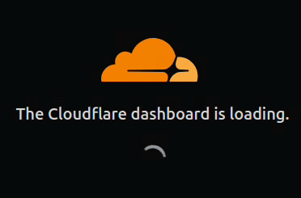
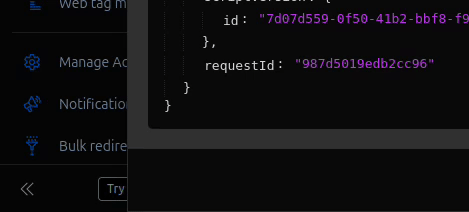
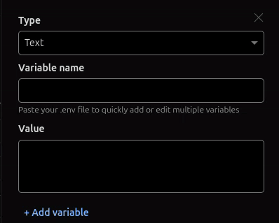
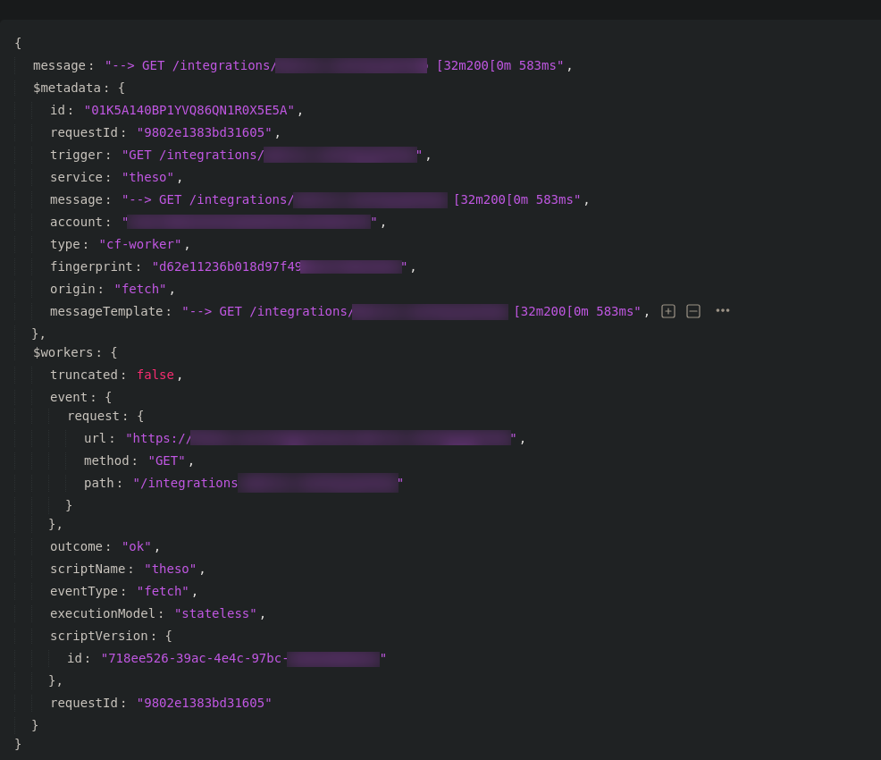
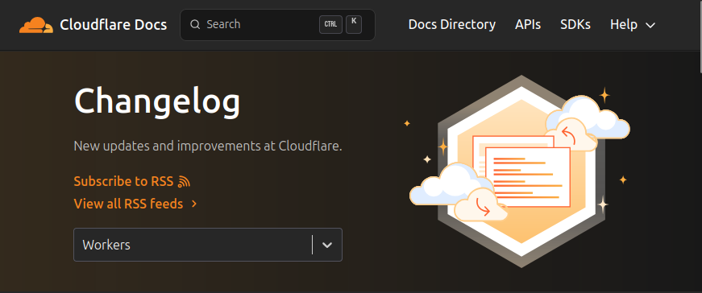

Professionally, we've both been mainly building on AWS. Slowly approaching our ten year
milestones, continuously digging through Cloudwatch logs and tweaking IAM permissions, we've
seen and build a lot.

But during this and the last year, when the time came to take on bigger private projects, we
decided to turn our backs on Bezo's cloud, and learn something new. We decided to go for
Cloudflare. This particular cloud promised to be something new and exciting for us. An
up-and-coming all-purpose cloud champion, build by an organization that already processes [over
20%](https://convergedigest.com/cloudflare-expands-network-powers-over-20-of-internet-traffic-in-2024/)
of global internet traffic.

## Getting our Feet wet

First coming into contact with the new cloud, the biggest question was "how to do?". For
cloudflare the answer is [wrangler](https://developers.cloudflare.com/workers/wrangler/). Wrangler
is mainly configured via its `wrangler.jsonc`, or `wrangler.toml`, while we started with the toml
file because it seemed easier to read.

Where AWS has
[SAM](https://docs.aws.amazon.com/serverless-application-model/latest/developerguide/what-is-sam.html),
[CDK](https://docs.aws.amazon.com/cdk/v2/guide/home.html),
[Cloudformation](https://docs.aws.amazon.com/AWSCloudFormation/latest/UserGuide/Welcome.html), the
[AWS CLI](https://docs.aws.amazon.com/cli/latest/userguide/cli-chap-welcome.html), [Elastic Beanstalk](https://docs.aws.amazon.com/elasticbeanstalk/latest/dg/Welcome.html) and more, Cloudflare has wrangler. It is both the one tool that can
stand up the local dev environment for all services, as well as the cloudflare cli tool, as well
as the deployment cli, alongside with helpers to extend the central `.toml` file.

Armed with our trusty all-purpose wrangler tool, we took on Cloudflare and started building.

## Available Services

Looking at the available services, Cloudflare as a development platform feels somewhat fresh. Being
traditionally known for its CDN, Firewall, DNS and Zero-Trust services, during the last few years,
this portfolio has extended. From basic compute capabilities, Cloudflare is slowly finding its
way, towards a more versatile [development platform](https://developers.cloudflare.com/).

This shows in the history of its dev-related General Availablity (GA) releases:
- 2018-03 [Workers go GA](https://blog.cloudflare.com/cloudflare-workers-unleashed/) a serverless
  compute platform
  - 2017-09 [early announcement](https://blog.cloudflare.com/introducing-cloudflare-workers/)
- 2019-05 [KV goes GA](https://www.infoq.com/news/2019/05/cloudflare-serverless-store/), a key-value
  score for read-heavy workloads
- 2021-11 [Durable Objects go GA](https://blog.cloudflare.com/durable-objects-ga/), a service to
   coordinate state across workers at Cloudflare's edge
- 2022-09 [R2 goes GA](https://blog.cloudflare.com/r2-ga/), a basic s3-compatible block storage
- 2024-04 [D1 goes GA](https://blog.cloudflare.com/making-full-stack-easier-d1-ga-hyperdrive-queues/)
  an sqlite-based instant serverless database
  - 2022-05: [early announcement](https://www.cloudflare.com/press/press-releases/2022/cloudflare-announces-d1-first-integrated-database/)
- 2024-09: [Queues go GA](https://blog.cloudflare.com/builder-day-2024-announcements)
  - 2022-09: [early announcement](https://blog.cloudflare.com/introducing-cloudflare-queues/)
- 2025-06: [Containers early announcement](https://blog.cloudflare.com/containers-are-available-in-public-beta-for-simple-global-and-programmable/)

## Top DX Moments

Let's start with the best. [Hono](https://hono.dev/) on cloudflare, is absolutely the gift that
keeps on giving. From humble beginnings with a single `index.tsx` file, our hono-based setup has
grown more and more. Starting with the [best practice
guide](https://hono.dev/docs/guides/best-practices), and the
[logger](https://hono.dev/docs/middleware/builtin/logger),
[secure-headers](https://hono.dev/docs/middleware/builtin/secure-headers) or
[cors](https://hono.dev/docs/middleware/builtin/cors) middleware, over to seamless valibot
[request validation](https://hono.dev/docs/guides/validation), hono knows what's right.

[Yusuke Wada](https://github.com/yusukebe), the creator of not only
[hono](https://github.com/honojs/hono) but also [honox](https://github.com/honojs/honox), has done
an amazing job here, and we're very thankful to him so we can continually use hono in our
projects.

Another great moment was the seamless plug-n-play ability of the AWS S3 version of cloudflare:
R2. It is promised to be S3 compatible, and it absolutely delivered. We were able to plug it into
our [mimir](https://grafana.com/oss/mimir/) instance as the block storage backend, with little to
no effort.

Our third highlight was the [release of containers
(beta)](https://blog.cloudflare.com/containers-are-available-in-public-beta-for-simple-global-and-programmable/)
this summer. It actually got released, just when we needed to deploy containers for one of our
projects, which was perfect timing. So far, we could stand up our whole full stack app, including
database, block storage and container services just on cloudflare, based on a simple
`wrangler.toml`. And it all runs locally in a single command.

## Top Surprises

Workers, the central way to do compute on cloudflare, have a `7 days max log retention`
([docs](https://developers.cloudflare.com/workers/observability/logs/workers-logs/#limits)).

Furthermore, workers in the free tier have `10ms maximum compute time per request`. This is
extended to 5 minutes maximum in the paid tier
([docs](https://developers.cloudflare.com/workers/platform/limits/#worker-limits)).

Gladly, for more sizable compute jobs, containers come to the rescue, a big feature released by
cloudflare this year. The 10ms compute time doesn't count the time we're waiting for responses,
which makes 10ms turn out to be a lot. Cloudflare also recently improved [CPU
performance](https://blog.cloudflare.com/unpacking-cloudflare-workers-cpu-performance-benchmarks/),
further increasing compute effectivity.

For the 7 day retention, we are publishing important logs also to our discord server, for better tracking.

## Top Oddities

The cloudflare web console, or the cloudflare "dash", seems like something that was build by
backend engineers. The UI itself is packed with lots of interesting information, and the seemingly
endless sidebar menu is clearly going places, but you better not hit refresh, or you will be hit
with one of these:

In general the dash seems a bit rough around the corners, with some UIs displaying almost no
information, while some UIs seem to try and contain almost all the information, but the love and
care for a nice dev experience is clearly seen. From the automatic "copied to clipboard", when
selecting some from a log:

To the explicit ability to paste your env file to create all your worker variables in one go:

Someone clearly cared here, and its very much appreciated.

## Top Disappointment

Looking through logs, we often found, logs are hard to read. Going through the logs often enough
almost felt like a data mining operation. As indicated in the screenshot below, which is one such
log entry, all sorts of information seems to be there, but the important bits could be in a
different spot everytime.

If there is one thing that would improve our debugging experience a lot, it would be logs that are
more to the point, and feel more understandable.

## Cloudflare Pages Faze Out

[Cloudflare Pages](https://pages.cloudflare.com/) was one service which we observed slowly dying
during our first year and a half or so.

While Cloudflare pages had a specific niche cut out, and had many features which workers didn't,
Cloudflare has been continually working on having all pages features also available in
workers. This leaves cloudflare users fewer and fewer reasons to use pages, while it is still
available and is still supported.

The [docs](https://developers.cloudflare.com/workers/static-assets/migration-guides/migrate-from-pages)
also point this out directly:

> Workers will receive the focus of Cloudflare's development efforts going forwards, so we
> therefore are recommending using Cloudflare Workers over Cloudflare Pages for any new projects.

To see how carefully this service is discontinued does show us how cloudflare currently handles
this common cloud provider challenge of service deprecation, and gives us a certain level of
comfort. Comparatively, AWS has historically rarely ever [discontinued
services](https://www.lastweekinaws.com/blog/the-clouds-competing-approaches-to-deprecation/), if
at all with long sunset plans, while this has only changed a bit
[recently](https://www.lastweekinaws.com/blog/aws-announces-service-deprecations/).

## Community Events & Updates

What's the Re:Invent for AWS, the big week during early December, when people come together and
lots of features are released, is the [Developer Week](https://www.cloudflare.com/developer-week/)
in the first weeks of **April** for cloudflare. So for us as newcomers, next April is going to be
an exciting week for us, and we're expecting at least a handful of substantial new additions.

Besides the focused developer week, cloudflare also continuously streams current and past
tech-related talks over at [cloudflare.tv](https://cloudflare.tv/). While the live-stream is often
a really wild mix, that together with the really well designed [public
changelog](https://developers.cloudflare.com/changelog/?product=workers), and the frequent
beta launches and updates on [the
blog](https://blog.cloudflare.com/an-ai-index-for-all-our-customers/), make it easy catch up with
news but also see what's next.

## Going Forward

Going forward, we're excited to see what's next for cloudflare. For our own experience, we would
love a slightly snappier dashboard, something we believe cloudlfare as an internet company can
definitely achieve. In the same vein, having the [bun runtime](https://bun.com/) available in
cloudflare workers would have us absolutely stunned.

But besides all that, if cloudflare can keep growing its capabilities while retaining the
simplicity and power of wrangler as the one developer tool, we believe we're going to have an
amazing time on this up and coming development platform. After a year of building on Cloudflare,
we're excited to see what the next year brings – and we'd recommend other developers give it a try
as well.
