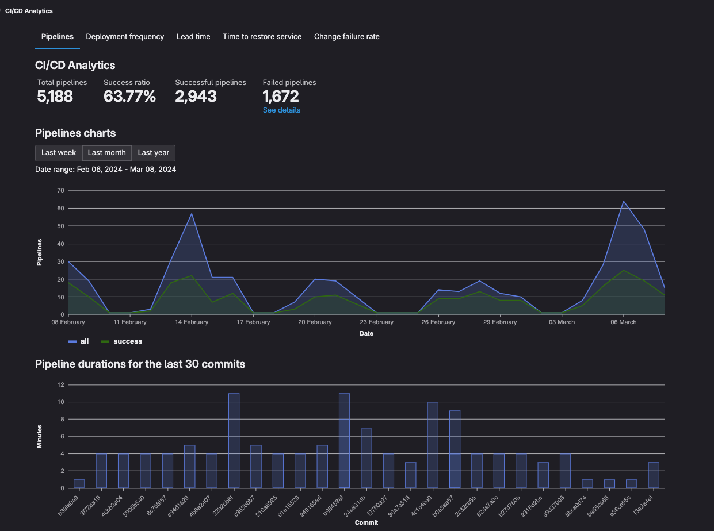
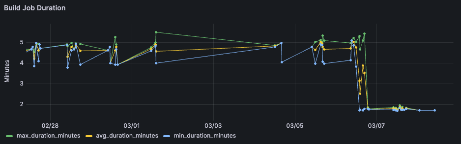
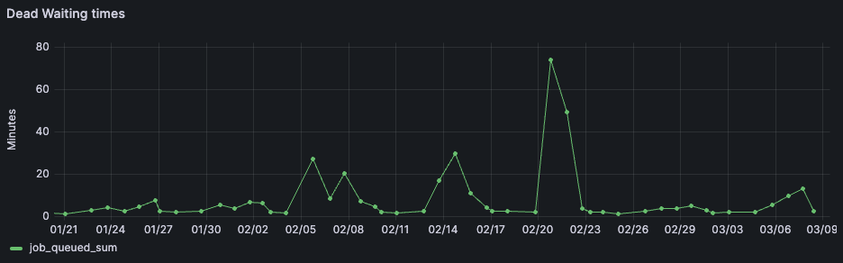
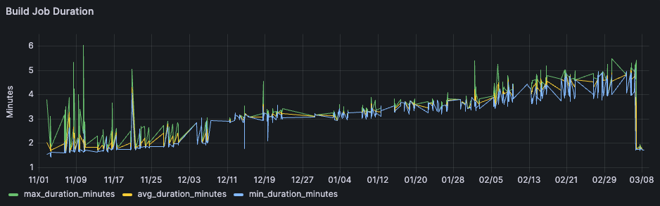
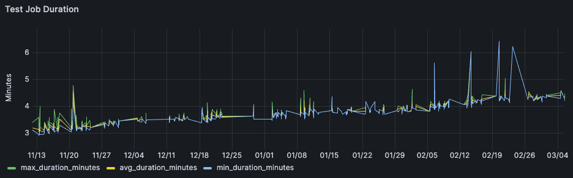
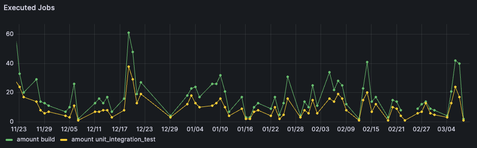

A recent optimization has left us again excited - the pipeline speed for a new project had
significantly improved. Execution times had basically cut in half across the board. Looking at a
few jobs we could confirm this on an individual basis, but we were wondering about the bigger
picture. How had the pipeline improved over a bigger timespan?


## Gitlabs Dashboards

Going into this questions the natural start were the existing gitlab dashboards. Gitlab has a wide
variety of different dashboards build-in, so it seemed likely that we would find the answer within
gitlab itself.

### CI/CD Analytics

Under the projects `Analyze` tab, there is the `CI/CD Analytics` dashboard. A basic view of the
number of successful and total pipeline runs. Below are the pipelines for the most recent
commit. Pipelines which fail early appear as shorter, which makes it not very useful for our
analysis.



Other dashboards in the `Analyze` tab sound intriguing, but they mostly display graphs based on
the amount of commits, merge requests, gitlab issues or lines changed.

### Build

In the `Build` tab we can browse through a list of recent jobs and pipelines. The results are simply
returned as a paginated table. For pipelines this can give an impression on an individual basis,
but grasping the overall trend over a longer period is hard.

Especially with the Jobs search getting a job overview is challenging. This search is infamous for
only allowing to filter by job status, not by name. The related issue
[#22027](https://gitlab.com/gitlab-org/gitlab/-/issues/22027) for the underlying api is 5 years
old, with many people wishing for its resolution.

## Grafana

Moving on from the gitlab metrics we turned our eyes towards grafana.

### Grafana Gitlab Plugin

The best experience can probably be had with the official [grafana gitlab
datasource](https://grafana.com/docs/plugins/grafana-gitlab-datasource/latest/). It comes free for
grafana cloud subscriptions, which also has a free tier, or for any grafana enterprise license.

Unfortunately in our scenario, we cannot simply pipe our corporate gitlab data into a grafana
cloud account for some ad-hoc analysis, and our company doesnt have the enterprise license. Though
it only supports the pipelines and not jobs, if your company fills these requirements, it might be
a good option for you.

### Grafana Gitlab Integration

The [grafana gitlab
integration](https://grafana.com/docs/grafana-cloud/monitor-infrastructure/integrations/integration-reference/integration-gitlab/)
concerns itself with the monitoring of gitlab runners. It shows the number of executed jobs,
together with a number of http status codes returned by the runners.


The related
[gitlab-ci-pipelines-exporter](https://github.com/mvisonneau/gitlab-ci-pipelines-exporter/tree/main)
in the screenshot above operates at the same level of the gitlab runner, but publishes many more
metrics, including the much desired job information. If you have your runners self-hosted on
kubernetes, together with a prometheus backend then this is probably the best option.

## Grafana and Sqlite

With the easy options off the table there were few choices left. We had to build something
ourselves, fetching the data via the gitlab api and ingesting them into some datasource.

The company that we work at does not have a grafana server and the only monitoring tool is
basically cloudwatch, to ingest this data we will have to start grafana locally.

### 1) Exploring the data

Gladly gitlab offers a supergraph, which can be easily explored with their public [graphql
explorer](https://gitlab.com/-/graphql-explorer). After a tries we had our paginated query:

```graphql
query jobs($after: String) {
  project(fullPath: "path/to/repo") {
    jobs(statuses: [SUCCESS, FAILED], after: $after, first:10) {
      pageInfo {
        startCursor
        endCursor
      }
      nodes {
        id
        name
        status
        startedAt
        finishedAt
        duration
        queuedDuration
        pipeline {
          id
          status
          computeMinutes
          duration
          complete
        }
      }
    }
  }
}
```

### 2) Fetching the data

Creating a small script is especially easy with bun. Bun's great usability together with great docs
and file api makes it a great fit for any smaller task.

```sh
mkdir fetchdata
cd fetchdata
bun init
```

In getting the data, we can retrieve as many pages as we like. The maximum page size is 100, so we
will need to call this function a couple of times until we hit our threshold.
```typescript
import { SQLite } from 'bun:sqlite';
import { file } from 'bun:fs';

// Environment variables for configuration
const REPO_PATH = 'path/to/repo';
const GITLAB_TOKEN = Bun.env.GITLAB_TOKEN;
const PAGE_SIZE = 100;
const JOB_LIMIT = 20000;
const DB_PATH = 'jobs_database.sqlite';
const GRAPHQL_ENDPOINT = 'https://gitlab.com/api/graphql';

async function fetchJobs(after?: string): Promise<{ jobs: JobData[]; nextCursor?: string }> {
  const query = `your GraphQL query here, including variables for pagination`;
  const variables = after ? { after, first: PAGE_SIZE } : { first: PAGE_SIZE };

  const response = await fetch(GRAPHQL_ENDPOINT, {
    method: 'POST',
    headers: {
      'Content-Type': 'application/json',
      'Authorization': `Bearer ${GITLAB_TOKEN}`,
    },
    body: JSON.stringify({
      query,
      variables,
    }),
  });

  const { data } = await response.json();
  const jobs: JobData[] = data.project.jobs.nodes;
  const nextCursor = data.project.jobs.pageInfo.endCursor;

  return { jobs, nextCursor };
}
```

### 3) Transforming the data

After we downloading the data, we can dump it into a sqlite database for local analysis. But
first, we will need the insert statements. With `ChatGPT` we can easily generate the related type
and create table statement, just based on the graphql query.

```typescript
interface JobData {
  id: string;
  name: string;
  status: string;
  startedAt: string;
  finishedAt: string;
  duration: number;
  queuedDuration: number;
  pipeline: {
    id: string;
    status: string;
    computeMinutes: number;
    duration: number;
    complete: boolean;
  };
}

// SQLite Database initialization
const db = new SQLite(DB_PATH);
db.query(`
  CREATE TABLE IF NOT EXISTS jobs (
    id TEXT PRIMARY KEY,
    name TEXT,
    status TEXT,
    startedAt TEXT,
    finishedAt TEXT,
    duration INTEGER,
    queuedDuration REAL,
    pipelineId TEXT,
    pipelineStatus TEXT,
    pipelineComputeMinutes REAL,
    pipelineDuration INTEGER,
    pipelineComplete INTEGER
  );
`);

function insertJobs(jobs: JobData[]) {
  jobs.forEach(job => {
    db.query(`
      INSERT INTO jobs (id, name, status, startedAt, finishedAt, duration, queuedDuration, pipelineId, pipelineStatus, pipelineComputeMinutes, pipelineDuration, pipelineComplete)
      VALUES (?, ?, ?, ?, ?, ?, ?, ?, ?, ?, ?, ?)
    `, [
      job.id,
      job.name,
      job.status,
      job.startedAt,
      job.finishedAt,
      job.duration,
      job.queuedDuration,
      job.pipeline.id,
      job.pipeline.status,
      job.pipeline.computeMinutes,
      job.pipeline.duration,
      job.pipeline.complete ? 1 : 0,
    ]);
  });
}

async function runIngestionProcess() {
  let endCursor: string | undefined = undefined;
  let jobsCounter = 0;
  do {
    const { jobs, nextCursor } = await fetchJobs(endCursor);
    insertJobs(jobs);
    jobsCounter += PAGE_SIZE;
    endCursor = nextCursor;
  } while (endCursor && jobsCounter < JOB_LIMIT);
  db.close();
}

runIngestionProcess()
```

### 4) Ingesting the data

Putting part 2 and 3 together, download and transformation only needs a `bun run`. The complete
code sample can also be found here: [gist](https://gist.github.com/flyck/e3deb7db07a5817dfb3a5c49b205a1c4).
```sh
bun run index.ts
```

For our 20000 jobs, which is the amount of jobs triggered by a 4 man team over 5 months in one
repository, the resulting sqlite file is 5MB. The bottleneck here is more with the fetching of the
job data, but in our two-step process we don't have to do this too many times.

### 5) Preparing Grafana

Next up is starting a local grafana instance.

```sh
mkdir data

docker run -d -p 3000:3000 --name=grafana \
  --user "$(id -u)" \
  --volume "$PWD/data:/var/lib/grafana" \
  -e "GF_INSTALL_PLUGINS=frser-sqlite-datasource" \
  grafana/grafana-enterprise
```

Of course we will also need our sqlite data:

```sh
cp jobs_database.sqlite data/
```

Now we can log into our fresh local grafana instance at http://localhost:3000. Here we need to add
this data as a new data source.

Once we initiated this process in the [data source
section](http://localhost:3000/connections/datasources/frser-sqlite-datasource), we can enter the
path to the sqlite database:

```sh
/var/lib/grafana/jobs_database.sqlite
```

### 6) Exploring the data

Finally we can play around with the data. In grafana the data is basically modelled via the query,
so it can then be displayed in various forms.

For example to display a table of the most recent jobs, the query looks like this:
```sh
SELECT * from jobs order by startedAt limit 10;
```

The dashboard that we used for our findings below can also be copied from the
[gist](https://gist.github.com/flyck/e3deb7db07a5817dfb3a5c49b205a1c4).

## Our Findings

On a job level, we could confirm our observed time-savings with real data, over all failed and
successful jobs.



We could also finally see the total amount of job queue times. It is the amount of time a gitlab
CI/CD job has to wait, before it gets picked up by a runner.



But what was even more interesting that that, was to see the job duration over a larger period of
multiple months. While the short-term analysis had confirmed our own observation that the build
job got much faster, much more was revealed looking at the same job over a longer timespan.



A visible bump around the start of december, together with a general slight upwards trend as the
project is getting bigger.

Looking at the test job, we could see a similar upwards trend over time, though the curve is not
as steep.



A couple of saved minutes on a single job wouldn't seem like a huge win, but for the team it *felt*
huge. This is related to other job dependencies which got also optimized, but also due to the
amound of times a single job gets triggered every day.

This is also something we can easily query:



Looking at the overall pipeline speed is more tricky. This is because pipline looks different
based on the branch, but also based on the amount of manual jobs which get triggered. Despite
that, we could still see the observed savings in the displayed graph on the very right.


## Rounding Up

Playing around with job data in grafana was extremely fun. Browsing around the ingested cicd data
with a tool as snappy and optimized as grafana made for a great experience.

The same technique of data analysis can be basically applied to any small dataset, which has
timestamps in it. Having such a technique in mind can break through such barriers of lackluster
default dashboards, while the data is availabe via api.

All in all it would be best to have a proper data platform where everything is already prepared to
do such analysis easily, either with grafana, datadog, or something similar. When these
preparations have not been made by your company, we hope the above approach can help you out in
this sitation.
