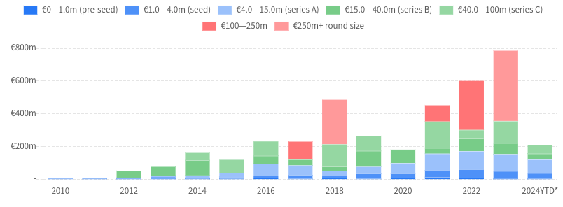

import Chart from "~/components/atoms/Chart.tsx";

What kind of jobs are available in the field? What kind of numbers do we see from companies, and
what is the trend overall? On a quest to answer all of these questions, we captured the current
state of German software jobs in one big consolidation of numbers.

## Hamburg Job Statistics

What are the jobs that we actually see in the Hamburg job market? To answer this question, we used
the job-scraper tool [jobspy](https://github.com/Bunsly/JobSpy) to get current job data in Hamburg
for the term "software developer". For these 157 available jobs that were posted this year, we then
extracted the required languages, framework and more using the `gpt-4o` model via the openai api.

<Chart type="pie" title={"Company Types"} data={[{"consulting":25,"regular":132}]} client:load />

Consulting definitely plays a sizable role in the software market. If you're a software developer
in Hamburg, there is a good chance, you're going to do it in consulting.

<Chart type="bar" title={"Top Languages"} data={[{"JavaScript":48,"Java":45,"SQL":44,"TypeScript":41,"C#":31,"Python":23,"Go":16,"C++":13,"Kotlin":12,"PHP":12,"Swift":8,"C":5,"Rust":5,"Ruby":4,"Scala":3,"SAP":3,"Golang":2,"Pascal":1,"Visual Basic .NET":1,"Perl":1}]} client:load />

With JavaScript corresponding to frontend jobs, we see Java as the dominant backend language in
Hamburg. With Java being already a bit dated, this points to older tech stacks, which need to be
maintained and extended.

<Chart type="bar" title={"Top Frameworks"} data={[{"React":37,"Angular":20,"Vue":16,"Svelte":3,"Spring Boot":1,"NodeJS":1,"Vue.js":1,"Fastify":1,"Express.js":1}]} client:load />

It's no surprise to see React at the top of the framework list, being the reigning champ.

<Chart type="bar" title={"Company Sizes"} data={[{"2 to 10":3,"1 to 50":4,"11 to 50":10,"51 to 200":19,"201 to 500":9,"501 to 1,000":6,"1,001 to 5,000":12,"5,001 to 10,000":9,"10,000+":16,"unknown":69}]} client:load />

The company size for available job goes across a wide range. Due to the big number of unlabeled
jobs this chart is somewhat irrelevant, but it gives us some hints. The grown startup seems the
most prevalent, while also many huge companies are still looking.

## Market Trends

The general amount of jobs follows the market, which after a big boom during COVID, is still on a
downwards trend. It could be that this trend falls back to to pre-COVID levels, due to a shrinking
economy in general, or it could plateau a little higher. A good indicator in the past, the number
of open HR positions, is still on a downwards trend. This indicates a continuation in the
shrinking of the job market.

<Chart type={"line"} title={"Market Trends in Germany"} data={[{"2020-1":100,"2020-2":96,"2020-3":82,"2020-4":79,"2020-5":81,"2020-6":83,"2020-7":85,"2020-8":85,"2020-9":88,"2020-10":91,"2020-11":95,"2021-0":99,"2021-1":100,"2021-2":104,"2021-3":107,"2021-4":112,"2021-5":117,"2021-6":125,"2021-7":134,"2021-8":138,"2021-9":145,"2021-10":150,"2021-11":155,"2022-0":156,"2022-1":158,"2022-2":160,"2022-3":163,"2022-4":166,"2022-5":166,"2022-6":162,"2022-7":161,"2022-8":157,"2022-9":156,"2022-10":156,"2022-11":153,"2023-0":146,"2023-1":145,"2023-2":139,"2023-3":131,"2023-4":124,"2023-5":121,"2023-6":119,"2023-7":117,"2023-8":112,"2023-9":112,"2023-10":109,"2023-11":106,"2024-0":105,"2024-1":98,"2024-2":91,"2024-3":87,"2024-4":84,"2024-5":81,"2024-6":78,"2024-7":77,"2024-8":73,"2024-9":72,"2024-10":72},
{"2020-1":103,"2020-2":98,"2020-3":71,"2020-4":61,"2020-5":59,"2020-6":61,"2020-7":63,"2020-8":66,"2020-9":73,"2020-10":74,"2020-11":75,"2021-0":81,"2021-1":86,"2021-2":94,"2021-3":105,"2021-4":114,"2021-5":129,"2021-6":144,"2021-7":158,"2021-8":172,"2021-9":188,"2021-10":197,"2021-11":200,"2022-0":214,"2022-1":226,"2022-2":231,"2022-3":239,"2022-4":244,"2022-5":240,"2022-6":245,"2022-7":240,"2022-8":236,"2022-9":228,"2022-10":216,"2022-11":204,"2023-0":205,"2023-1":203,"2023-2":194,"2023-3":192,"2023-4":185,"2023-5":185,"2023-6":192,"2023-7":191,"2023-8":185,"2023-9":177,"2023-10":163,"2023-11":152,"2024-0":152,"2024-1":145,"2024-2":140,"2024-3":137,"2024-4":132,"2024-5":124,"2024-6":123,"2024-7":121,"2024-8":118,"2024-9":117,"2024-10":114}]} dataLabels={["HR Jobs", "Software Jobs" ]}source={"https://data.indeed.com/#/postings"} client:load />

While the curve shows the German job availability in general, the reduction of available software
jobs is one of the highest, as mentioned in the [indeed
report](https://www.hiringlab.org/de/blog/2024/09/27/indeed-arbeitsmarkt-index-september-2024/),
with 35% less jobs compared to last year.

## Investments

What are the recent investments in the Hamburg startup scene? Thankfully the platform
[hamburg.dealroom](https://hamburg.dealroom.co/intro), co-initiated by the [city's government
agency](https://www.hamburg.de/politik-und-verwaltung/behoerden/bwi), can provide us with some
numbers here.

<i>Startup Investments in Hamburg</i>

Recent investments in the million range show well-known local technology companies like
[Heyflow](https://heyflow.com/), [Plancraft](https://plancraft.de/),
[Shipzero](https://shipzero.com/), [airfocus](https://airfocus.com/) or
[Zive](https://www.zive.com/). These are exactly the companies which have visible on the job
boards this year, providing attractive job opportunities with modern software stacks.

Last years investments like [1Komma5Grad](https://1komma5.com/) with 430 million series B,
[impossible cloud's](https://de.impossiblecloud.com/) 7 million seed,
[awork's](https://www.awork.com/) 5 million series A or [nuvo's](https://www.getnuvo.com/) 3
million seed round are still somewhat in the picture, while they have mostly faded away from the
software job boards.

## Job Satisfaction

While job opportunities are adapting to pre-COVID levels, job satisfaction is on the decline. This
was captured by the recent Stack Overflow development survey.

<Chart type="bar" vertical={true} title={"Job Satisfaction (%)"} data={[{"Not Happy at Work": 33,"Complacent at Work": 47.7,"Happy at Work":19.3}]} source={"https://survey.stackoverflow.co/2024"} client:load />

This perceived high difference caused somewhat of an outcry, which was covered by engineering
social media, with noteworthy videos from [@ThePrimeagen](https://x.com/ThePrimeagen) and
[Fireship](https://www.youtube.com/@Fireship):

<iframe width="560" height="315" src="https://www.youtube.com/embed/-pSf9_MgsZ4?si=UcQoPmScxAJBBvZu" title="YouTube video player" frameborder="0" allow="accelerometer; autoplay; clipboard-write; encrypted-media; gyroscope; picture-in-picture; web-share" referrerpolicy="strict-origin-when-cross-origin" allowfullscreen></iframe>

Comparing these to numbers from the pre-COVID [2020 stackoverflow developer
survey](https://survey.stackoverflow.co/2020#work-how-do-developers-feel-about-their-jobs), the
number of people happy about their jobs has gone down by at least 10% (comparing "very satisfied"
at 32% in 2020, with "happy at work" at 19% in 2024).

## The Big Stay

Coined as a US phenomenon, the big stay indicates that people are holding on to their current
jobs. With new job opportunities on the decline, it seems natural that people will stay.

A
[report](https://www.linkedin.com/business/talent/blog/talent-acquisition/big-stay-is-still-here)
by Linkedin states, while the employee retention rate increases, at the same time the number of
job applications has increased by 14%. The article hints in the end:

> Of course, people can only change jobs when there are jobs available, so the state of the
> economy will likely dictate if and when things turn around.

## From "the Big 4" to "With 4"

In the past, working at the big 4 was the pinnacle of software engineering. Spotify's vertical
teams, Amazon's leadership principles, Facebook's monorepo setup - what the big 4 were doing had
widespread ripple-effects on the whole industry.

With big tech either doing [massive layoffs](https://www.trueup.io/layoffs), or holding out on
hiring in favor of the big AI revolution, times have changed. From being drivers of software
culture and dream companies, a job at the big 4 has not only become harder to attain, but also way
less attractive.

This leaves software engineers with a new trend, of joining smaller teams, instead of massive
engineering organizations. Instead of working at the big 4, working with 4 colleagues at a company
of a smaller size seems much more probable. These companies are likely to not have a major focus
in tech, but to only invest in software as part of their digitization efforts.

<blockquote class="twitter-tweet" data-media-max-width="560">
Sam Altman says 1 person + 10,000 GPUs could make a billion-dollar company <a href="https://t.co/ZjtFbc31dS">pic.twitter.com/ZjtFbc31dS</a>
&mdash; Tsarathustra (@tsarnick) <a href="https://twitter.com/tsarnick/status/1855012753410531766?ref_src=twsrc%5Etfw">November 8, 2024</a></blockquote> 

## With Enough Thrust...

There is an old saying: "With sufficient thrust, pigs fly just fine." With enough money, almost
anything can fly. During the COVID boom, we saw many companies thriving. But which companies are
fit enough to make it beyond the initial thrust? For a long-distance flight, it
needs great tools and a great process.

Here we see a possible connection between declining developer job satisfaction, and struggling software
companies. This can be attributed at least in part to the current software planning process, which is all centered around jira, and which we
believe to be far from great. We believe if we had a new way for roadmapping for software planning, we as an industry would be doing much better (see our [other
post](https://double-trouble.dev/post/agile-roadmaps-release/)).

## Rounding Up

Concluding the investigation, we see that Hamburg software jobs are currently rather
conservative. While JavaScript reigns supreme in the twitter tech space, and Java is not that
popular, the real world is different. Here, Java is still dominant. Here we found a big
correlation between big startup investments and exciting tech stacks. It is fun to see great jobs
and VC money almost lining up.

With more VC money currently flooding into the JavaScript echo-system, like the [$4.6 million
investment](https://www.voidzero.dev/posts/announcing-voidzero-inc) in the build tool vite, deno
with its [$22 million in 2022](https://deno.com/blog/series-a), or even the recent [$57 million
investment](https://laravel-news.com/laravel-raises-57-million-series-a) into PHP's laravel, we see
more investments in those technologies that we often discuss on twitter.

Tech that we're excited to see, like the Bun JavaScript runtime, Node.JS, Go or Zig in the
backend, is of course much less represented in the market. As time progresses and the tools get
even better, we predict that these technologies will at some point dominate the market, pushing
Java to the sidelanes.
